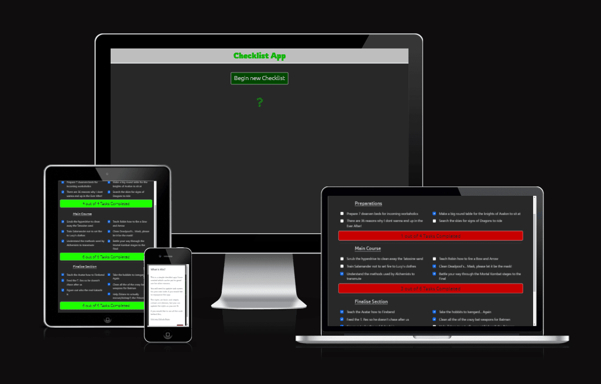

# **JavaScript Checklist App**

## # Table of Contents

1. [Link to Live Site](#link-to-live-site)
1. [Overview](#overview)
1. [Wireframes](#wireframes)
1. [User Stories](#user-stories)
1. [Features](#features)
   1. [Style Choices](#style-choices)
   1. [Favicon](#favicon)
   1. [Index Page](#index-page)
   1. [Checklist Page](#checklist-page)
   1. [Modal](#modal)
1. [Implementation](#implementation)
1. [Features to Implement](#features-to-implement)
1. [Testing](#testing)
   1. [HTML](#html)
   1. [CSS](#css)
   1. [JavaScript](#javascript)
1. [Unfixed Bugs](#unfixed-bugs)
1. [Deployment](#deployment)
   1. [Local Deployment](#local-deployment)
   1. [Remote Deployment](#remote-deployment)
1. [Credits](#credits)

## **Link to Live Site**

https://lukemunsch.github.io/checklist-app/

## **Overview**

This will be a mobile- or tablet-focused checklist app that allows you to keep track of tasks that require completion and allows the user to print a report.

This is built using very simple styles and html - The main aspect of this was to build a successful Task Checklist using Javascript in order to update the styles and text throughout the page.

## **Wireframes**

[Index Page Here](assets\img\readme-img\checklist-screengrab.png)

[Checklist Page Here](assets\img\readme-img\checklist-screengrab2.png)

## **User Stories**

The purpose of this app is to allow people to create a list of tasks that they need to complete in a few sections.

The list of tasks and titles can be customised to your own needs as well as adding new tasks i you need to by copying and pasting them into the correct sections. The task's sections will update and change the count field when you complete tasks and when all the teasks have been completed, the print button is enabled at the bottom to print a report.

## **Features**

Aside from the header which is copied across both pages and has only the title in it, the app has no footer specifically for information, only the checklist page has a button for enabled print report.

### Style Choices

There is not a lot of style placed on this as the main focus is to show examples of the javascript, but this is still suitable for use on multiple screens, clearly showing changes in design styles as well as text to update when changes are completed. Anything positive is changes to green and anything negative is red. There are also a few buttons that are all basic and have hover effects to brighten the colors.

### Favicon

As a checklist app, I have chosen a check in a box in a positive green color. The background color is the same as the main page color. It fits the style and prupose of the app.

### Index Page

The index page is the simplest of the two pages; It has a simple button to take you to the Task list, and a '?' to display a modal about the app.

### Checklist Page

This checklist page performs the most of the functionality and interactivity. The tasks are divided into sections, headed with a title and each tasks is a checkbox that updates each section's banner with the amount of completed tasks. Once the set of tasks is all 'checked', the banner changes color noticably to a green color.

At the top of the page and above the footer there are a few action buttons; a restart button at top and bottom, a back button at top of the page and a 'to the top' button for the bottom fo the page. restarts are green and movement buttons are in red.

At the bottom of the page there is also the footer which states if there are tasks to compete or if the print button is enabled. the button is normally in a disabled black state until all tasks are completed and turns green like the banners.

### Modal

The modal is a plain white box with text and a button to close; as with modals if you click off the modal anywhere it will minimise the modal.

## **Implementation**

## **Features to Implement**

It may be good to have the ability to edit the tasks or add tasks to the list, but currently the list is fixed, but manually adding more code through a workspace environment will still allow the checklist app to be updated.

## **Testing**

I have put the checklist app through different validators in order to make sure I am compliant with my code.

### HTML

[Index Page](assets/img/readme-img/cl-index-html.png)
[Checklist Page](assets/img/readme-img/cl-checklist-html.png)

### CSS

[CSS file](assets/img/readme-img/cl-validator-css.png)

### JavaScript

[Script File](assets/img/readme-img/cl-validator-js.png)

## **Unfixed Bugs**

Currently there are no unfixed bugs in this app - It is all working smoothly

## **Deployment**

### Local Deployment

#### _Forking Repo_

To propose fixing changes to some code, or to use the code as a starting point for your own project, you can fork the repository by clicking the 'Fork' button in the top right hand corner of the Github repository page.

#### _Cloning Repo_

To clone a repository to use in your own project you can:

- Click on the 'Code' button next to the gitpod link which will bring down a dropdown menu, from there either:
  - Clone the repository by copying the link for the repo and using it for your own project,
  - Downloading the zip of the file to use for your own project.

### Remote Deployment

Whether you have cloned, forked, downloaded an existing repository or created your own repository, you can deploy your code to the web from your repository page. To complete this, you can:

1. Navigate to settings (upper right of the page).
2. On the left, navigate downwards to the Pages section.
3. When the page loads there would be a dropdown in main section of page, choose main/master.
4. Hit Save and wait for link to show as: "Your site is published at
   https://<'your-github-repo'>.github.io/<'app-name'>/"

## **Credits**

https://www.iconsdb.com/guacamole-green-icons/check-mark-2-icon.html - page for the favicon
Stack Overflow and all its users for demonstrating fixes to issues I was having with checkbox changing.
